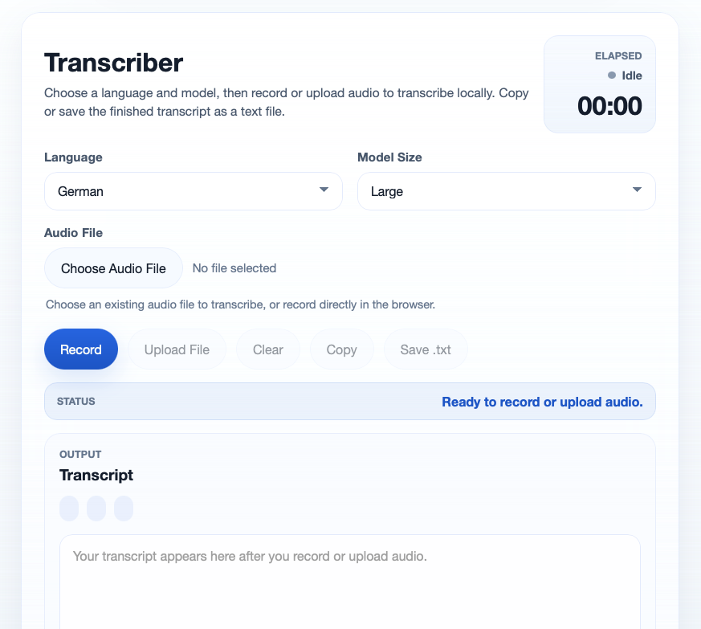

# Transcriber

**Local browser-based transcription app for Apple Silicon Macs.** It runs a FastAPI backend with a small vanilla frontend and uses `mlx-whisper` for on-device speech-to-text, with an optional Microsoft VibeVoice ASR 7B backend for diarized transcripts.

[](https://github.com/rnckp/transcriber)
[](https://fastapi.tiangolo.com/)
[](https://developer.mozilla.org/docs/Web/HTML)
[](https://www.apple.com/mac/)

[](https://github.com/rnckp/transcriber/stargazers)
<a href="https://github.com/astral-sh/ruff"></a>



## Features

- Runs locally on Apple Silicon.
- Browser-based microphone recording and local audio file processing.
- Local transcription with configurable language and model selection.
- Optional Microsoft VibeVoice ASR 7B transcription with speaker diarization and segment timestamps.
- Transcript metadata in the UI, including language, model, and detected duration.
- Copy-to-clipboard and save-as-`.txt` actions for completed transcripts.
- Configurable host, port, cache directory, upload limits, and browser status strings.
- Automatic per-model download and reuse through a local cache.
- Remembers the last selected language and model in the browser.
- Simple JSON API for programmatic use.

## Requirements

- macOS on Apple Silicon
- Python 3.12+
- `uv`

## Quick Start

```bash
uv sync
uv run uvicorn app.main:app --reload
```

Open `http://127.0.0.1:8000` in your browser.

In the browser UI, choose a language and model, then either record in the browser or process an audio file. The app shows recording and processing state, clears old output when a new recording starts, and displays language, model, and duration metadata with the result. Finished transcripts can be copied to the clipboard or saved locally as plain `.txt` files.

## Configuration

Runtime settings live in `config.yaml`.

Key options:

- `server.host` and `server.port` control where the app listens.
- `logging.level` controls structured application logging.
- `transcription.cache_dir` stores downloaded Whisper model files.
- `transcription.max_upload_size_mb` limits upload size.
- `transcription.upload_chunk_size_mb` controls temp-file streaming chunk size while uploads are staged.
- `transcription.default_upload_filename` defines the fallback filename used for browser recordings.
- `transcription.supported_languages` defines the language picker and backend validation.
- `transcription.supported_model_sizes` defines the available models and backend for each option.
- `transcription.vibevoice_repo_path` points to the local VibeVoice checkout used by the VibeVoice ASR backend.
- `transcription.vibevoice_max_new_tokens` caps VibeVoice generation length; raising it can sharply increase RAM use.
- `ui.*` tunes browser-side status text, timer labels, and button copy without editing JavaScript.

The default configuration includes German and English, a 100 MB upload limit, and `tiny`, `base`, `small`, `medium`, `large`, and `vibevoice-7b` model options.

## Model Caching

Model files are downloaded the first time a model size is used and then reused from the configured cache directory. Switching to a model that is not cached yet triggers a one-time download into a per-model directory under `transcription.cache_dir`.

## API

The backend exposes one transcription endpoint:

- `POST /api/transcriptions`

Multipart form fields:

- `audio`: uploaded audio file
- `language`: configured language code such as `de` or `en`
- `model_size`: configured model id such as `small` or `large`

Successful responses return JSON with:

- `transcript`
- `language`
- `model_size`
- `duration_seconds`
- `segments`, populated for diarizing models such as `vibevoice-7b`

Error responses use a consistent shape:

```json
{
  "error": {
    "code": "unsupported_language",
    "message": "Choose German or English."
  }
}
```

The API returns `400` for invalid requests or unsupported choices, `413` for oversized uploads, and `500` if transcription fails.

## Development

Install dependencies:

```bash
uv sync
```

Run checks:

```bash
uv run ruff format .
uv run ruff check .
uv run pytest -v
```

## Project Layout

- `app/`: FastAPI app, API routes, services, and static frontend assets
- `tests/`: API and service tests
- `config.yaml`: runtime configuration

## Status

This project is currently focused on a local, minimal transcription workflow.

## License

MIT License
